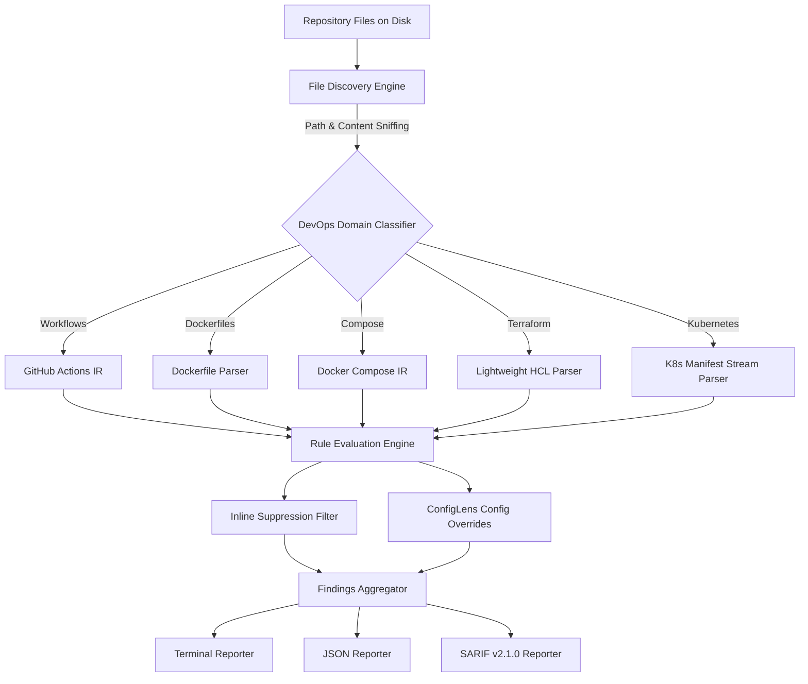

# ConfigLens

[](https://github.com/MuhammadAashirAslam/ConfigLens/actions)
[](https://pypi.org/project/configlens/)
[](https://opensource.org/licenses/MIT)
[](https://www.python.org/)

**Static Analysis & Technical Debt Detection for DevOps Configuration**

ConfigLens is an open-source static analysis engine and CLI that scans repository DevOps configurations — GitHub Actions workflows, Dockerfiles, Docker Compose files, Terraform HCL, and Kubernetes manifests — to detect configuration debt, maintenance fragility, and security anti-patterns without building containers or requiring cloud network access.

---

## Architecture Overview



---

## Core Product Principles

- **Zero Network, Zero Build:** Scans run entirely offline without querying Docker daemons, cloud providers, or the internet.
- **Unified Mental Model:** One CLI, one consistent report, and one technical debt model across all DevOps configurations in a repo.
- **Actionable Remediation:** Every finding provides exact source line numbers, severity classification, and copy-paste ready fix suggestions.
- **High Performance:** Designed to run sub-second on local commits (<1s across hundreds of files) and gate CI pipelines.

---

## Supported Configuration Categories

| Category | File Detection Patterns | Key Debt & Anti-Patterns Scanned |
|---|---|---|
| **GitHub Actions** | `.github/workflows/*.{yml,yaml}` | Unpinned action versions, missing dependency caching, duplicate steps, missing timeouts |
| **Dockerfile** | `Dockerfile*`, `*.dockerfile` | `:latest` base images, root containers, consecutive RUN layers, hardcoded secrets |
| **Docker Compose** | `compose*.{yml,yaml}`, `docker-compose*.{yml,yaml}` | Plaintext passwords, unpinned images, missing restart policies, broad 0.0.0.0 binds |
| **Terraform** | `*.tf`, `*.tfvars` | Missing `lifecycle.prevent_destroy`, unpinned providers, hardcoded secrets, unused variables |
| **Kubernetes** | `*.{yml,yaml}` (`apiVersion` + `kind`) | Missing CPU/memory resource limits, missing health probes, root containers, `:latest` tags |

---

## Installation

```bash
# Install from PyPI
pip install configlens

# Or install locally for development
git clone https://github.com/MuhammadAashirAslam/ConfigLens.git
cd ConfigLens
pip install -e ".[dev]"
```

---

## CLI Usage

```bash
# Scan current repository (default: terminal output, fail on HIGH or CRITICAL)
configlens scan .

# Filter scan by specific category
configlens scan . --only terraform,kubernetes

# Output machine-readable JSON
configlens scan . --format json > report.json

# Output SARIF v2.1.0 for GitHub Code Scanning
configlens scan . --format sarif > results.sarif

# Run specific rule preset (e.g. security-focused or debt-focused)
configlens scan . --preset security

# Configure pass/fail exit threshold
configlens scan . --fail-on critical

# Provide custom ignore patterns
configlens scan . --ignore .configlensignore
```

---

## CI/CD Integration

### GitHub Actions (`action.yml`)

Add ConfigLens to your pull request checks:

```yaml
name: DevOps Config Hygiene
on: [push, pull_request]

jobs:
  configlens:
    runs-on: ubuntu-latest
    steps:
      - uses: actions/checkout@v4
      - name: Run ConfigLens Scan
        uses: MuhammadAashirAslam/ConfigLens@v0.1.0
        with:
          path: .
          fail-on: high
          format: terminal
```

### Pre-commit Hook

Add to your `.pre-commit-config.yaml`:

```yaml
repos:
  - repo: https://github.com/MuhammadAashirAslam/ConfigLens
    rev: v0.1.0
    hooks:
      - id: configlens
```

---

## Configuration & Suppressions

### Project Configuration (`.configlens.yml`)

```yaml
fail_on: high
rules:
  dockerfile-multiple-run-layers:
    enabled: false
  compose-missing-restart:
    severity: low
```

### Inline Suppressions

Suppress specific findings directly in code using comment directives:

```yaml
# configlens-ignore: gha-unpinned-action-version
- uses: actions/checkout@v4
```

Or suppress for a whole block:

```hcl
# configlens-ignore: tf-hardcoded-secret
resource "aws_db_instance" "dev" {
  password = "local-dev-password"
}
```

---

## Documentation Links

- [Complete Rule Catalog & Remediation Guide](docs/rules_reference.md)
- [Baseline Validation Report](docs/baseline_report.md)
- [Sample JSON Report](examples/report_sample.json)
- [Sample SARIF v2.1.0 Report](examples/report_sample.sarif)

---

## License

Distributed under the [MIT License](LICENSE). Copyright (c) 2026 Muhammad Aashir Aslam.
